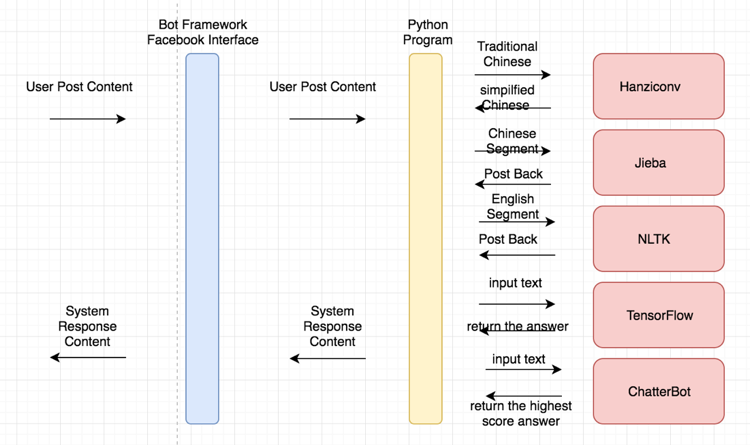
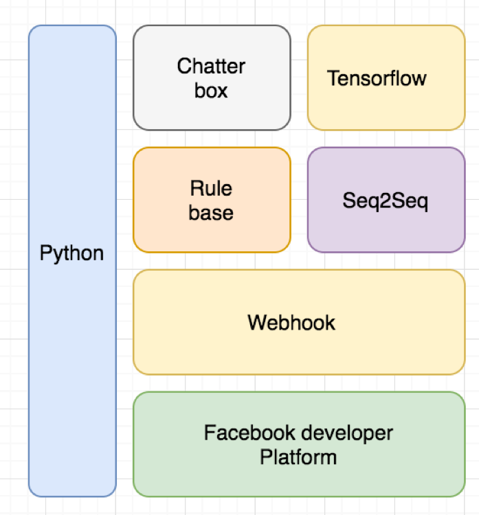
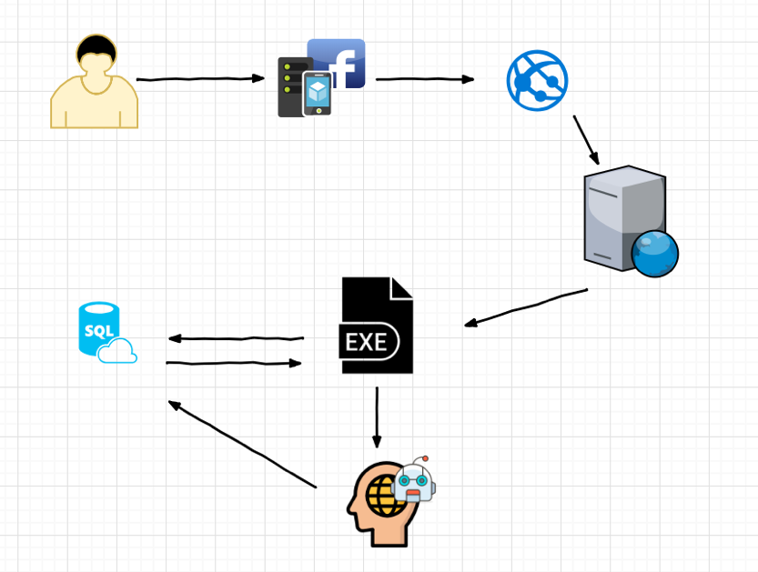
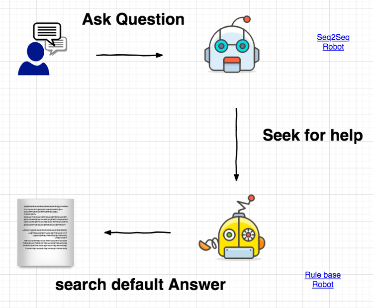
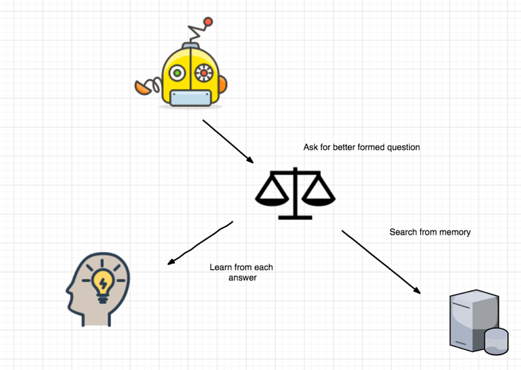

<p align="center">
  <h1 align="center">Python-Key-Chatbot</h1>
  <p align="center">Facebook Chatbot Application Using Python</p>
</p> 


[]() 

### Keyword
> `Chatbot` `Python` `Webhook` `Facebook Messenger` `RNN` `Generation Based` `Sequence to Sequence` `LSTM` `Chatterbot` `Rule Based` `Task-Specific`


## Contents 
<!-- toc -->
* [Introduction](#introduction)
* [Hybrid Approach​](#hybrid-approach)
* [System Structure](#system-structure)
* [Environment](#environment)
* [Author](#author)
* [Function](#function)
* [Screenshots](#screenshots)
* [Installation](#installation)
    * [Command](#command)
* [Contact](#contact)
* [License](#license)

<!-- toc stop -->

## Introduction

<b> Important Notice: This project mix some different other project. You may find that the code is extremely <span style="color:red"><em>messy</em></span>. Do not expect learning something from here. Thank You!
<br>
<br>
The trained model file is oversized. If you want to try this program, you have to download my trained model file from ... nowhere, contact me please.


## Hybrid Approach​

- **Generation based** -  (Sequence to Sequence)​​
- **Rule based** – Chatterbot​
- **Task-Specific Approach** – Frame based
- **Additional Functions ​** – Customized

#### Quick links
- [How to Host a Python and Flask Facebook Messenger Bot on Heroku](https://www.twilio.com/blog/2018/02/facebook-messenger-bot-heroku-python-flask.html) - the project is greater than 2G, cannot use heroku<br>
- [Chatterbot Official Website](http://chatterbot.readthedocs.io) - Rule Based Chatbot<br>
- [ChatLearner](https://github.com/bshao001/ChatLearner) - English Sequence to Sequence Chatbot<br>
- [just_another_seq2seq](https://github.com/qhduan/just_another_seq2seq/tree/master/chatbot) - Chinese Sequence to Sequence Chatbot<br>


## System Structure
System Flow Chart

Chatbot Tech Stack

Dataflow between User and Chatbot 

Chatterbot and S2S switching (Now is random)




## Environment
- Python: 3.6.7 <br>
- pip: 18.1 <br>
- Flask <br>
- Jieba <br>
- NLTK <br>
- Hanziconv <br>
- Chatterbot <br>
- Tensorflow: 1.7.0 <br>


## Author
- [Key](https://github.com/tavik000) <br>
- Billy <br>
- Kenneth <br>
- Baron <br>

## Function
- Generation based (Sequence to Sequence)​
	1. Chinese chit-chat​
	2. English chit-chat​
- Rule based (Chatterbot)
	1. Chinese chit-chat​
	2. English chit-chat​
	3. Confidence evaluation
- Task-specific Approach (Frame based)​
	1. Booking services for movies​
- Additional functions (Chinese and English)​
	1. Emoji response
	2. Telling Joke
	3. Simple calculation
	4. Provide date and time
	5. Prevent repetitive response
	6. Traditional Chinese compatible

### Using Corpus or Dataset
- Chinese conversation corpus​
- Cleaned reddit data​
- Papaya dataset​
- Cleaned Cornell movie dialogs
- Chatterbot dataset (Simplified Chinese & traditional Chinese)
- Chatterbot dataset (English)


-----


## Screenshots
Feature:

- Time checking <br>


- Replying by emoji <br>


- Telling jokes <br>


- Simple calculations <br>


- Chinese chit-chat <br>


- Questions to check and confirm user intent and Framed based Template <br>


- English Chitchat Template using Facebook API <br>


- Repetitive Detection <br>


- English chit-chat <br>


-----

## Installation


### 1. Clone Repo

```bash
$ git clone git@github.com:tavik000/python-key-chatbot.git
```

### 2. Download the trained model 

`basic.data-00000-of-00001` and `chatbot.pkl` from me (Contact me) <tavik002@gmail.com>. 

### 3. Put the file in the right location

locate model file `basic.data-00000-of-00001` in "./Hybrid/chatbot/Data/Result/" 
<br>
locate `chatbot.pkl` to "./Hybrid/chatbot/"

### 4. Build a Facebook App

Check this link to build up a Facebook Messenger Chatbot. You don't need to build up the server, it already in this program - [How to Host a Python and Flask Facebook Messenger Bot on Heroku](https://www.twilio.com/blog/2018/02/facebook-messenger-bot-heroku-python-flask.html)

###5. Modify program

Go to "./Hybrid/chatbot/", modify `test_hybrid.py` file, change ACCESS_TOKEN to your Facebook Page token generated in Facebook App (Follow the instruction No.4 then you will know what I mean) and set your own VERIFY_TOKEN whatever you like

### 6. Set up python server config

Go to project root folder `python-key-chatbot` and set up your own server config

### 7. Run the program and start the server

```bash 
$ python3 app.py
``` 
To run the python server
  
### 8. Set up Facebook Webhook

Go to Facebook for developer website and set up your Webhook, put your server url and ACCESS_TOKEN in the textholder. 

### 9. Happy Chatbot 

You are ready to go, test your chatbot by sending it message in Facebook Messenger.


**If you like this, please leave a star.**

-----


## Contact


Email:  Key <tavik002@gmail.com>

-----
## License
MIT License

Copyright (c) 2018 key

Permission is hereby granted, free of charge, to any person obtaining a copy
of this software and associated documentation files (the "Software"), to deal
in the Software without restriction, including without limitation the rights
to use, copy, modify, merge, publish, distribute, sublicense, and/or sell
copies of the Software, and to permit persons to whom the Software is
furnished to do so, subject to the following conditions:

The above copyright notice and this permission notice shall be included in all
copies or substantial portions of the Software.

THE SOFTWARE IS PROVIDED "AS IS", WITHOUT WARRANTY OF ANY KIND, EXPRESS OR
IMPLIED, INCLUDING BUT NOT LIMITED TO THE WARRANTIES OF MERCHANTABILITY,
FITNESS FOR A PARTICULAR PURPOSE AND NONINFRINGEMENT. IN NO EVENT SHALL THE
AUTHORS OR COPYRIGHT HOLDERS BE LIABLE FOR ANY CLAIM, DAMAGES OR OTHER
LIABILITY, WHETHER IN AN ACTION OF CONTRACT, TORT OR OTHERWISE, ARISING FROM,
OUT OF OR IN CONNECTION WITH THE SOFTWARE OR THE USE OR OTHER DEALINGS IN THE
SOFTWARE.


[⬆ Back to top](#contents)

**All Copyright Reserved**
